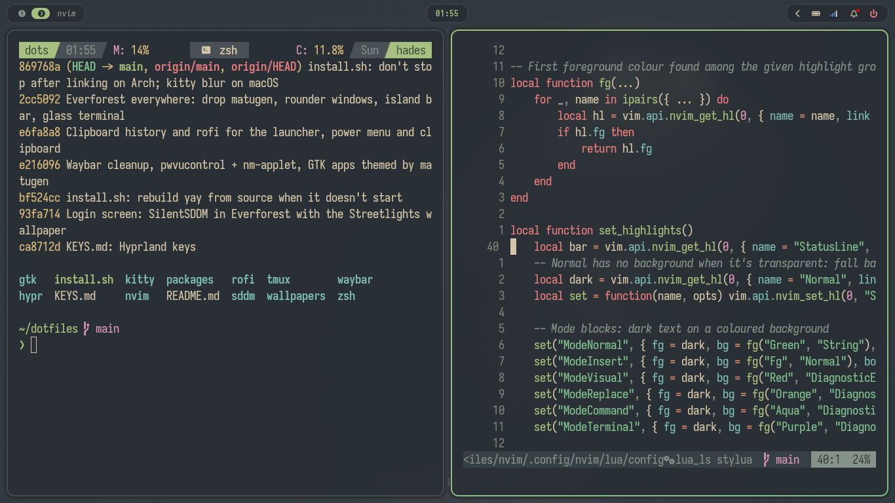
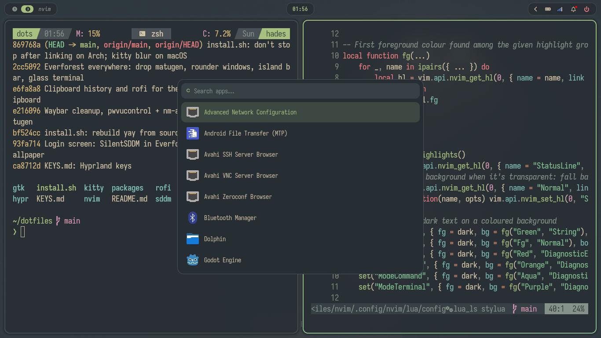
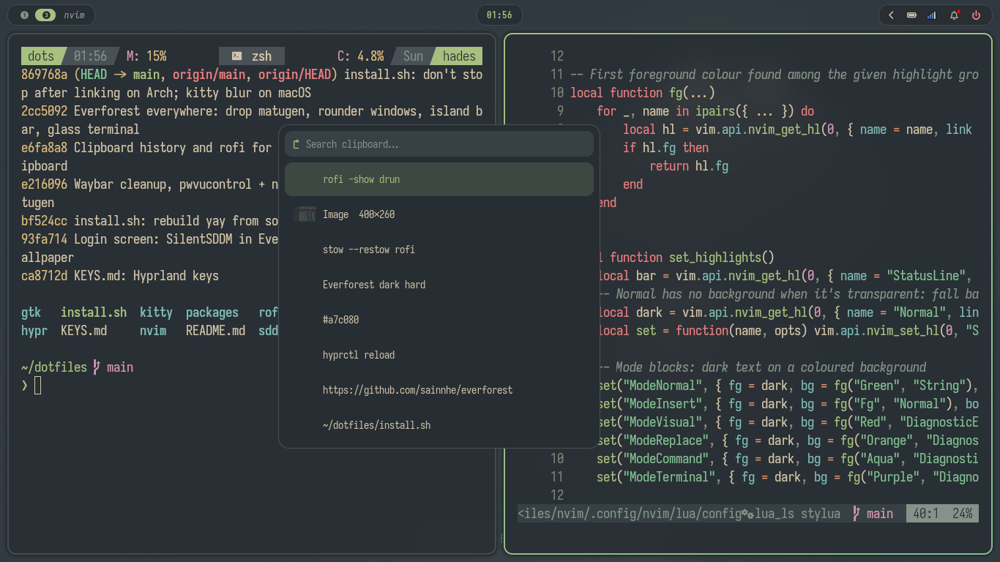
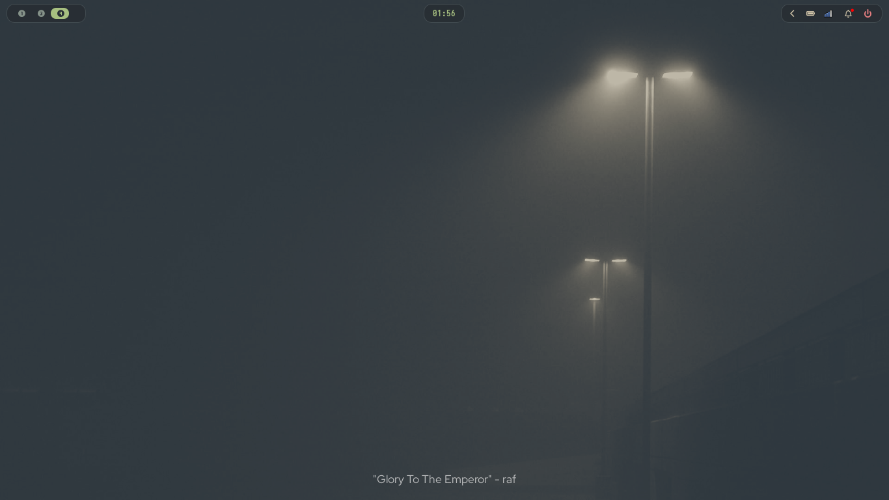

# dotfiles

Configs for Arch Linux and macOS, linked into place with [GNU Stow](https://www.gnu.org/software/stow/).

All the keys (Neovim, tmux, zsh, kitty, Hyprland, AeroSpace) are in [KEYS.md](KEYS.md).

## Screenshots

Arch Linux with Hyprland, everything in [Everforest](https://github.com/sainnhe/everforest) dark hard.



| App launcher (`Super+D`) | Clipboard history at the mouse (`Super+Shift+V`) |
| --- | --- |
|  |  |



## Configs

| package | links to |
| ------- | -------- |
| `zsh`   | `~/.zshrc` |
| `tmux`  | `~/.config/tmux/tmux.conf` |
| `nvim`  | `~/.config/nvim/` |
| `kitty` | `~/.config/kitty/` |
| `wallpapers` | `~/.local/share/wallpapers/` (Everforest walls: streetlights on Arch, a street shop on macOS) |
| `hypr` | `~/.config/hypr/` (Arch only: Hyprland, hyprpaper, power menu and screenshot scripts) |
| `waybar` | `~/.config/waybar/` (Arch only) |
| `rofi` | `~/.config/rofi/` (Arch only: app launcher, power menu, clipboard popup) |
| `gtk` | `~/.config/gtk-3.0/gtk.css`, `~/.config/gtk-4.0/gtk.css` (Arch only: Everforest colours for GTK apps) |
| `aerospace` | `~/.config/aerospace/` (macOS only: AeroSpace tiling and JankyBorders, the counterpart of Hyprland) |
| `sddm/` | login screen (Arch only, not linked: `./install.sh login` copies it into place with sudo) |

Everything uses the Everforest dark hard palette: `hypr/colors.conf`, `waybar/colors.css`,
`rofi/colors.rasi` and `gtk/` hold the same colours in each program's format
(`aerospace.toml` repeats the border colours, since it can't read another file).

## Machine-local settings

Settings, secrets and keys that belong to one machine stay out of this repo. Each config loads them
from a place that isn't committed:

| config | local files | loaded |
| ------ | ----------- | ------ |
| zsh | `~/.config/zsh/local/*.zsh` (e.g. `env.zsh`, `secrets.zsh`, `aliases.zsh`) | last, so they can override the defaults |
| tmux | `~/.config/tmux/local/*.conf` (bindings, startup commands) | last; gitignored, since `~/.config/tmux` is linked into the repo |
| Neovim | `~/.config/nvim/lua/local.lua` (e.g. work plugins) | last; gitignored |

AeroSpace can't include a local file, so its app rules here stay generic (kitty on workspace 1).

To pick up changes to `.zshrc`, open a new terminal. Don't `source ~/.zshrc` in a running shell:
it loads zsh-autosuggestions a second time, and Tab then fails with
`maximum nested function level reached`. Re-sourcing only the local files is fine.

## Install

On a new machine (Arch Linux or macOS):

```sh
git clone https://github.com/Nozeren/dots.git ~/dotfiles
~/dotfiles/install.sh
```

That installs the packages, links the configs and makes zsh the default shell.
It's safe to re-run whenever something is added.

| command | what it does |
| ------- | ------------ |
| `./install.sh` | everything below; before linking it lists the files it would replace and asks |
| `./install.sh packages` | install packages: `packages/arch.txt` with pacman (plus `packages/aur.txt` with yay), or `packages/Brewfile` with Homebrew (installed if missing) |
| `./install.sh link [pkg...]` | symlink configs into `$HOME` with Stow, no prompt; existing files are moved to `~/.dotfiles-backup/<timestamp>/` (for nvim: the whole old `~/.config/nvim` and `~/.local/share/nvim`) |
| `./install.sh nvim` | install Neovim plugins, language servers, formatters and treesitter parsers without opening Neovim (list in `nvim/.config/nvim/lua/config/tools.lua`) |
| `./install.sh login` | (Arch) apply the SilentSDDM login screen theme from `sddm/`, with the Streetlights wallpaper |
| `./install.sh update` | bring a machine up to date: pull this repo, update packages, re-link the configs that are linked, update Neovim plugins/language servers/formatters/parsers, zsh and tmux plugins. Commit `nvim-pack-lock.json` afterwards if it changed |

On macOS:

- A kitty installed by hand in `/Applications` is kept (the Brewfile skips the cask).
- An old Neovim installed by hand in `/usr/local/bin` can shadow Homebrew's; check with `which -a nvim`.
- AeroSpace and borders come from third-party taps; newer Homebrew may ask you to `brew trust` them.

Edit files in `~/dotfiles`; the symlinks mean changes apply immediately.
When a config starts using a new tool, add it to both package lists.
